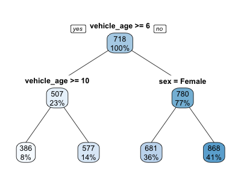
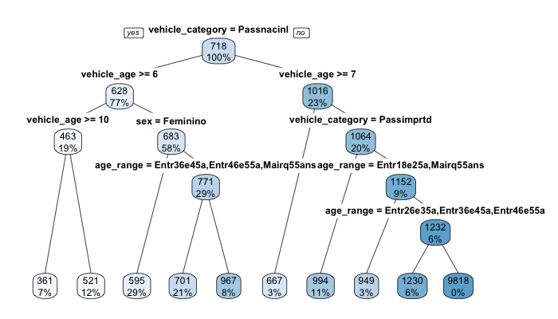
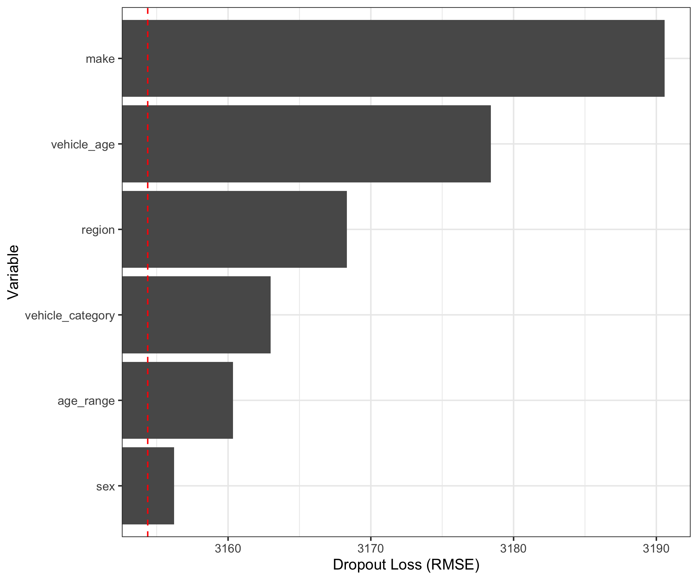
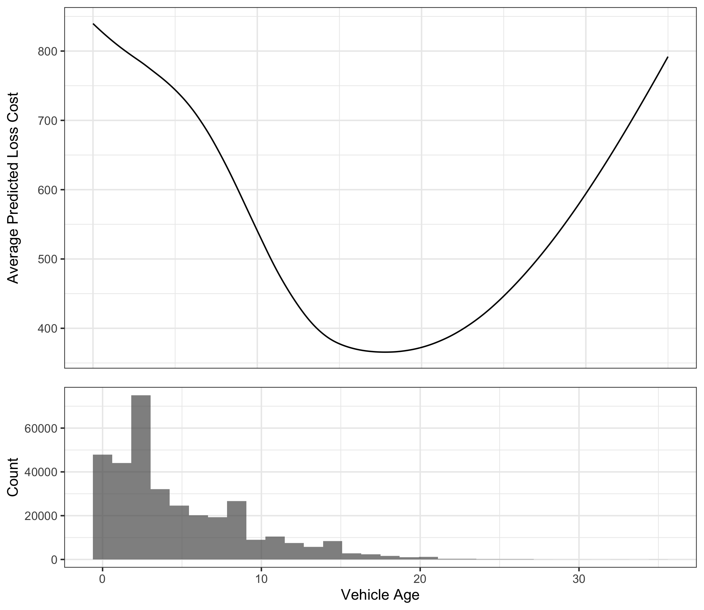
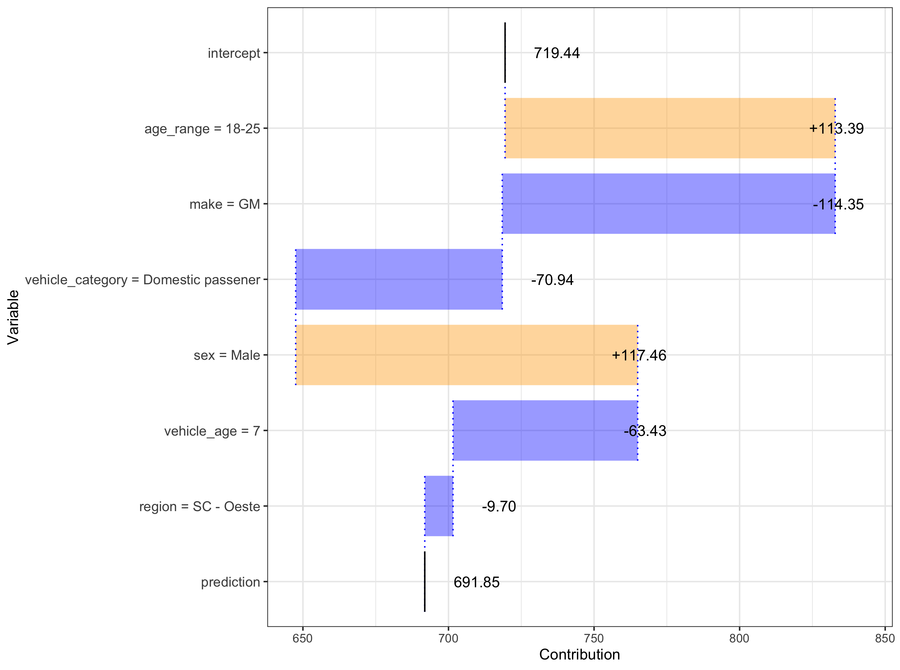

# Introduction

Risk classification for property & casualty (P&C) insurance rating has traditionally
been done with one-way, or univariate, analysis techniques. In recent years, many
insurers have moved towards using generalized linear models (GLM), a multivariate
predictive modeling technique, which addresses many shortcomings of univariate
approaches, and is currently considered the gold standard in insurance risk
classification. At the same time, machine learning (ML) techniques such as deep 
neural networks have gained popularity in many industries due to their superior
predictive performance over linear models [@lecunDeepLearning2015]. In fact, there
is a fast growing body of literature on applying ML to P&C reserving
[@kuoDeepTriangleDeep2018; @wuthrichMachineLearning2018; @gabrielliNeuralNetwork2019a;
@gabrielliNeuralNetwork2019]. However, these ML techniques, often considered to be
completely “black box”, have been less successful in gaining adoption in pricing, 
which is a regulated discipline and requires a certain amount of transparency in models.

If insurers can gain more insight into how ML models behave in risk classification
contexts, it would increase their ability to reassure regulators and the public 
that accepted ratemaking principles are met. Being able to charge more accurate 
premiums would, in turn, make the risk transfer system more efficient and contribute
to the betterment of society. In this paper, we aim to take a step towards liberating 
actuaries from the confines of linear models in pricing projects, by proposing a 
framework for explaining ML models for ratemaking that regulators, practitioners,
and researchers in actuarial science can build upon.

The rest of this paper is organized as follows: Section \ref{ratemaking} provides
an overview of P&C ratemaking, Section \ref{need} discusses the importance of 
interpretation, Section \ref{interpretability} discusses model interpretability 
in the context of ratemaking and proposes specific tasks for model explanation,
Section \ref{application} describes current model interpretation techniques and 
applies them to the tasks defined in the previous section, and Section 
\ref{conclusion} concludes.

# Property and Casualty Ratemaking {#ratemaking}

## History of Ratemaking

Early classification ratemaking procedures were typically univariate in nature.
For example, @lange_1966 notes that (at that time) most major lines of insurance 
used univariate methods based around the same principle: distributing an overall 
indication to territorial relativities or classification relativities based on 
the extent to which they deviated from the average experience.

@bailey_simon_1960 introduced minimum bias methods, which were expanded 
throughout the 60s, 70s, and 80s. As computing power developed, minimum bias 
began to give away to GLMs, with papers such as @brown_1988 and @mildenhall_1999 
bridging the gap between the methods.

Arguably, GLMs predate minimum bias procedures by a significant margin. The term 
was coined by @nelder_wedderburn_1972, but generalizations of least squares 
linear regression date back at least to the 1930s. Like minimum bias methods, 
GLMs did not become mainstream in actuarial science for some time. For example, 
the syllabus of basic education of the Casualty Actuarial Society (CAS) does not 
seem to include any mention of GLMs 
prior to @brown_1988 in the 1990 syllabus. From there, GLMs 
seem to have received only passing mention until 2006 with the introduction of 
@anderson_2005 to the syllabus.

## Machine Learning in Ratemaking

Paralelling the development of GLM was the development of machine learning 
algorithms throughout the middle part of the 20th century. Detailed histories 
of machine learning may be found in sources such as @nilsson_2009 and 
@wang_raj_2017. Consistent with GLMs, machine learning was relatively unpopular 
in actuarial science until the last ten years as computing power has become cheaper
and more easily available and as machine learning software packages have obviated
the need for developing analyses from scratch each time an analysis is performed.
Due to the breadth of machine learning as a field, it is difficult to identify 
the first time it entered the CAS syllabus; however, cluster analysis (in the 
form of k-means) seems to have been first included in 2011 with @robertson_2009.
More recently, the CAS MAS-I and MAS-II exams introduced in 2018 have included 
machine learning explicitly.

Within the area of ratemaking, machine learning is still in its infancy. A 
significant portion of machine learning applications to ratemaking has been in 
the context of automobile telematics, such as @gao_2018, @gao_2018_2, @gao_2019,
@roel_2018, or @wuthrich_2017. Presumably this focus has been a result of the 
high-dimensionality and complexity of telematics data, making it a field in 
which the unique abilities of machine learning techniques give a clear 
advantage over traditional approaches.

Outside of telematics, @yang_2018 uses a gradient tree-boosting approach to 
capture non-linearities that would be a challenge for GLMs. @henckaerts_2018 
makes use of generalized additive models (GAM) to improve predictions of GLMs.
Many researchers, in an apparent effort to demonstrate the range of possibilities
and advantages of machine learning, have approached the topic by comparing many
different machine learning algorithms within a single study, such as in
@dugas_2003, @noll_2018, @spedicato_2018. These studies make use of such varied
techniques as regression trees, boosting machines, support vector machines, and 
neural networks.

## Ratemaking Process

Regardless of the method employed for determining this risk of various 
classifications, the actual process of setting rate relativities typically 
involves some variation of the following steps:

1. Obtain relevant policy-level data
2. Prepare data for analysis
3. Perform analysis on the data, employing desired method(s) to estimate
needed rates
4. Select final rates based on rate indications
5. Present rates to the reglator, including explanation of the steps followed to 
derive the rates
6. Answer questions from regulators regarding the method employed

The focus of this paper is on steps 5 and 6. In particular, rate regulators are 
concerned with whether rates are inadequate, excessive, or unfairly 
discriminatory. In many states, rate filings that exceed certain thresholds for
magnitude of rate changes or filings that make use of new or sophisticated 
predictive models may be subject to particular regulatory scrutiny. In these cases,
it is necessary to be able to explain the results of the modeling process in a 
way that is understandable without sacrificing statistical rigor.

It should be noted that communicating results is not simply a method of passing 
regulatory muster. Generating interpretable modeling output is an important - 
even essential - facet of model checking. Therefore, the techniques discussed 
in this paper may be viewed from the lens of providing useful information to 
regulators, but they should also be considered as part of a thorough vetting of 
any rating model.

# The Need to See Inside the Black Box {#need}

Within the actuarial profession, Actuarial Standard of Practice 41 ("Actuarial 
Communications") notes that "...another actuary qualified in the same practice 
area [should be able to] make an objective appraisal of the reasonableness of 
the actuary's work as presented in the actuarial report." [@asop_41] Underlying 
this requirement is an assumption that the hypothetical other actuary qualified 
in the same practice area is adequately familiar with the relevant techniques 
employed. Although the syllabus of basic education is constantly changing, there
has at times been an assumption that all techniques and assumptions that have 
ever been a part of the syllabus of basic education needn't be explained from 
first principles in general actuarial communications, and that an actuary 
practicing in the same field should be able to make an objective appraisal of 
the results from the methods found in the syllabus.
This is notable because, beginning with the introduction
of the CAS MAS-I and MAS-II examination in July of 2018, several machine learning 
models were formally included in the syllabus of basic education. These exams 
cover a wide range of topics, such as splines, clustering algorithms, decision 
trees, boosting, and principle components analysis [@cas_syllabus_2018].

Nevertheless, machine learning poses something of a special challenge for ASOP 
41 for several reasons:

1. Machine learning models can be very ad hoc compared to 
traditional statistical models.
2. Because many machine learning models do not assume an underlying probability
distribution or stochastic process, they may not admit of standard metrics for model comparison 
(e.g., it's not straightforward to calculate an AIC over a neural network). 
3. Machine learning methods are often combined into ensembles that 
may not be easily separated and that may, as a collection, cease to resemble 
a single standard version of a model.
4. Machine learning models can be "black boxes" insofar as the final form of 
response curve cannot be easily predicted and may depend heavily on the 
available data (which may not, in turn, be available to the reviewer).

This last item raises a final interesting issue. GLMs and their ilk are often 
fitted using one of a handful of standard and well-understood approaches (e.g.,
maximum likelihood estimation). However, this is not possible in general with 
machine learning models, as machine learning algorithms often use loss surfaces 
that are very complex such that it may not be feasible to calculate the global 
minimum of the surface. Certainly, closed form representations of the loss 
surfaces are not generally available. For this reason, the training phase of a 
machine learning model is, in many ways, just as important to one's 
understanding as the model form and the data on which the model is fitted. 
Because the final model result is inseparable from these three components 
(training method, model form, and data), it is not generally adequate to just
know the method employed to make an objective appraisal of the reasonableness 
of the result. More information is necessary.

Of course, these comments only apply within the actuarial profession. Outside of 
the actuarial profession, communication of results may be more challenging. A 
2017 survey conducted by the Casualty Actuarial and Statistical Task Force of 
the National Association of Insurance Commissioners (NAIC) found that the plurality of
responding regulators identified "Filing complexity and/or a lack of resources 
or expertise" as a key challenge that impedes their ability to review GLMs or 
other predictive models [@naic_summer_2017]. Given that machine learning 
algorithms are generally regarded as more complex than GLMs, this implies that
the challenge of communicating machine learning model results is significant.

In response to the same survey, 33 state regulators noted that it would be 
helpful or very helpful for the NAIC to develop information and tools to assist
in reviewing rate filings based on GLMs, and 34 noted that it would be helpful 
to develop similar items to assist in reviewing "Other Advanced Modeling 
Techniques." One outgrowth of this need was the development of a white paper,
@naic_white_paper, on best practices for regulatory review of predictive models.
The white paper focuses on review of GLMs, particularly with respect to private
passenger automobile and homeowners' insurance. Some of the guidance offered in
this regard is therefore not strictly applicable to the review of machine 
learning models. For example, as previously noted, p-values are not a concept
that translates well to deterministic machine learning algorithms. However,
among the guidance applicable to machine learning algorithms are the following:

* Determine the extent to which the model causes premium disruption for individual 
policyholders and how the insurer will
explain the disruption to individual consumers that inquire about it.
* Determine that individual input characteristics to a predictive model are 
related to the expected loss or expense
differences in risk. Each input characteristic should have an intuitive or 
demonstrable actual relationship to expected loss or expense.
* Determine that individual outputs from a predictive model and their associated
selected relativities are not unfairly discriminatory.

These items are by no means exhaustive, but they pertain to the concept of model
interpretability for ratemaking that we develop next.

# Interpretability in the Ratemaking Context {#interpretability}

In this section, we attempt to develop a working definition of interpretability
for ratemaking applications. While we will not provide a comprehensive survey of
the prolific and fast evolving ML interpretability literature, we draw from it 
as appropriate in setting the stage for our discussion. Even among researchers 
in the subject, there is not a consensus on the definition of interpretability;
here are a few from frequently cited papers:

- Ability to explain or to present in understandable terms to a human 
[@doshi-velezRigorousScience2017];
- The degree to which an observer can understand the cause of a decision 
[@biranExplanationJustification2017]; and
- A method is interpretable if a user can correctly and efficiently predict the 
method’s results [@kimExamplesAre2016]. 

We motivate our discussion by considering several aspects of interpretability. 
As we proceed through the points below, we aim to arrive at a more scoped and 
relevant definition of what it means for a pricing
model to be interpretable. In the remainder of this section, we clarify a couple concepts regarding 
interpretable *classes* of models and the computational transparency of ML
models, outline frameworks for understanding the communication goals of interpretability,
then discuss a potential framework for implementing ML 
interpretability in practice.

## Not All Linear Models are Interpretable {#linear-models}

In the actuarial science literature, the GLM is probably the most oft-cited
example of an easily interpretable model. Given a set of inputs, we can easily
reason about what the output of the model is. As an illustrative example, 
consider a claim severity model with driver age, sex, and vehicle age as 
predictors; assuming a log link function and letting $Y$ denote the response, we
have

\begin{align}
& \log(E[Y]) = \beta_0 + \beta_1 \cdot \text{age} \nonumber \\
& \quad + \beta_2 \cdot \text{vehicle\_age} + \beta_3 \cdot \text{sex}_{\text{male}}.
\end{align}

Here, we can tell, for example, what the model would predict for the expected 
severity if we were to increase age by a certain amount, *all else being equal*,
because the relationship between the predictor and the response is simply 
multiplication by the coefficient $\beta_1$ and applying the inverse link
function.

Another commonly cited example of an interpretable model is a decision tree. An
illustrative example is shown in Figure \@ref(fig:tree-plot1). Here, the 
prediction is arrived at by following a sequence of if-else decisions.

```{r tree-plot1, echo = FALSE, fig.cap="A simple decision tree for loss cost prediction.", out.width="100%", fig.align='center'}

```

Now, it is worth pointing out that, when declaring that GLMs or decision trees 
are interpretable models, we are implicitly assuming that we are considering 
only a handful  of predictors. In fact, the ease with which we can reason about a
model declines as the number of predictors, transformations of them, and
interactions increase, as in the following (somewhat pathological) example:

\begin{align}\label{eq:badglm}
& \log(E[Y]) = \beta_0 + \beta_1 \cdot \text{age} + \beta_2 \cdot \text{vehicle\_age} \nonumber\\
& \quad + \beta_3\cdot\text{vehicle\_age}^2 \nonumber \\
& \quad + \beta_4 \cdot \text{age} \cdot \text{vehicle\_age} \nonumber \\
& \quad + \beta_5 \cdot \text{sex}_{\text{male}} + \beta_6 \cdot \text{sex}_{\text{male}} \cdot \text{age}. 
\end{align}

Similarly, one can see that in Figure \@ref(fig:tree-plot2), larger trees are
tough to reason about. In other words, even when working within the framework
of an "interpretable" class of models, we may still end up with something that
many would consider "black box."

```{r tree-plot2, echo = FALSE, fig.cap="A more complex decision tree. This is still much simpler than typical realistic examples.", out.width="60%", fig.align='center',  fig.env='figure*'}

```

## The Machinery is Not a Secret

Another occasional misconception is that we have no visibility into how some ML
models *compute* predictions, which renders them uninterpretable. Outside of 
proprietary algorithms, all common ML models, including neural networks, 
gradient boosted trees, and random forests, are well studied and have large
bodies of literature documenting their inner workings. As an example, a fitted
feedforward neural network is simply a composition of linear transformations
followed by nonlinear activation functions. As in Equation \ref{eq:badglm}, one
can write down the mathematical equation for calculating the prediction given
some inputs, but it may be difficult for a human to reason about it. We show
later that we can still provide explanations of completely "black box" models,
but is important to note that ML model predictions are still governed by
mathematical rules, and are deterministic in most cases.

## Explanations are Contextual

@hiltonConversationalProcesses1990 proposed a framework, later interpreted by
@millerExplanationArtificial2017 in the context of ML, for understanding model explanations
as *conversations* or *social interactions.* One consequence of this identification
is that explanations need to be *relevant* to the *audience*. This framework is
consistent with ASOP 41, which formulates a similar requirement in terms of an
*intended user* of the actuarial communication. In developing,
filing, and operationalizing a pricing model, one needs to accommodate a variety
of stakeholders, each of whom has a different set of questions, assumptions,
and technical capacity. First, there are internal stakeholders at the company,
which includes management and underwriters. While some of the individuals in
this audience may be technical, they are likely less familiar with predictive
modeling techniques than the actuaries and data scientists who build the models.
Next, we have the regulators, who may have limited resources to review the
models, and will focus on a specific list of questions motivated by statute
and public policy. Finally, we have potential policyholders, who have an interest (perhaps
more so than the other parties) as they are responsible for paying the premiums.

It is interesting to note that the modelers, who are most familiar with the
models, tend to be same people designing and communicating the explanations.
This poses a challenge that @millerExplainableAI2017 calls "inmates running
the asylum", where the modelers design explanations for *themselves* rather
than the intended audience. For example, they may be interested in technical
questions, such as extrapolation behavior, and shape the explanations accordingly,
which may be irrelevant to a prospective policyholder.

Another point outlined in Miller's survey [@millerExplanationArtificial2017] is
that explanations are *contrastive*. In other words, people are often interested
in not why something happened, but rather why it happened instead of something
else. For example, policyholders might not care exactly how their auto premiums
are computed, but would like to know why they are being charged more than their
coworkers who drive similar vehicles. As an extension, policyholders may want
to know what they can change in order to obtain lower premiums.

## Asking and Answering the Right Questions

With the above considerations in mind, we propose a potential framework for
interpreting ML models for insurance pricing: the actuarial profession, in
collaboration with regulators and representatives of the public, define a set
of questions to be answered by explanations accompanying ML models, along
with acceptance criteria and examples of successful explanations. In other
words, interpretability for our purposes is defined as the ability of a model's
explanations to answer the posed questions.

It should be noted that no ideal set of questions exists that would encompass
all potential models. Rather, the actuary must consider what aspects of the
model would raise questions from the perspective of the model's intended users.
We propose that relevant stakeholders, by providing example questions and
answers, would inherently provide guidance by which actuaries can reasonably
anticipate the kinds of specific questions most important to those stakeholders
and address them proactively.

These questions should relate to existing guidelines, such as those described in
@naic_white_paper and outlined in Section \ref{need}, standards of practice, and
regulation, and in fact should not be specific only to ML models. By
conceptualizing a set of questions, we reduce the burden of both companies and
regulators; this is especially important for the latter, who are already
resource constrained facing increasing variety of models being filed. This
format should also be familiar to actuaries who are accustomed to adhering to
specific guidelines in, for example, ASOPs. Like the ASOPs, We envision that
these questions and guidelines will be continually updated to reflect feedback
obtained and advances in research.

While the realization of a set of such guidelines is an ambitious undertaking
beyond the scope of this paper, we present in the next section a sample set of
questions and techniques one can leverage to answer them. The goal of these case
studies is twofold: to more concretely illustrate the proposed framework, and
to expose the actuarial audience to modern ML interpretation techniques.

# Applying Model Interpretation Techniques {#application}

Now that we have established a framework for model interpretation in the form of
asking and answering relevant questions, we demonstrate examples of such
exchanges via an illustrative case study. Analytically, our starting point is a
fitted deep neural network model for predicting loss costs. As the modeling
details are of secondary importance, they are available in Appendix
\ref{model-dev}. The questions that we ask of the model are as follows:

1. What are the most important predictors in the model? Put another way, to
what extent do the predictors improve the accuracy of the model?
2. How does the predicted loss cost change, on average, as we change an input?
3. For a particular policyholder, how does each characteristic contribute to
the loss cost prediction?

In our discussion, we adopt the organization of techniques and some notation
presented in @molnar2018interpretable and @biecekPMVEE, which are comprehensive
references on the most established ML interpretation techniques.

## A Simplified View of Interpretation Techniques

Before we dive into the answering questions, we present a brief taxonomy of ML
interpretation techniques. Rather than attempting an exhaustive classification,
the goal is to orient ourselves among broad categories of techniques, so we can
map them to tasks indicated by the questions being asked. For our purposes,
model interpretation techniques can be categorized across two dimensions:
intrinsic vs. post-hoc and global vs. local.

### Intrinsic vs. Post-hoc

Intrinsic model interpretation draws conclusions from the structure of the
fitted model and are what we typically associate with "interpretable" classes
of models. This is only viable with models with simple structures, such as the
sparse linear model and shallow decision tree we see in Section
\ref{linear-models}, where we arrive at explanations by reading off parameter
estimates or a few decision rules. For algorithms that produce models
with complex structure that do not lend themselves easily to intrinsic
exploration, we can appeal to post-hoc techniques. This class of techniques
interrogate the model by presenting it with data for scoring and observing the
prediction behavior of the model. These techniques are concerned with only the
inputs and outputs, and hence are *agnostic* of the model itself, which means
they can also be applied to simple models. Since most useful ML models have a
level of complexity beyond the threshold of intrinsic interpretability, we focus
on model-agnostic techniques in our case study. As we will see later on, the
data that we present to the models are usually some perturbed variations of test
data.

### Global vs. Local

Along the other dimension, we categorize model interpretations as global, or
model-level, and local, or instance-level. The former class provides insights
with respect to the model as a whole. Some examples of these eplanations include
variable importances and sensitivities, on average, of the predicted response
with respect to individual predictors. In our case study, questions 1 and 2 are
associated with this category. On the other hand, question 3 pertains to an
individual prediction, which would fall in the local, or instance-level,
category. In addition to individual variable attribution, we can also inquire
about what would happen to the current predicted response if we were to perturb
specific predictor variables.

## Answering the Questions

Having aligned the questions with the categories of interpretation techniques,
we now introduce a selection of appropriate techniques to answer them.

### Variable Importance

"What are the most important predictors in the model?"

For linear models and their generalizations, and some ML models, measures of
variable importance can be obtained from the fitted model structure. In the
case of GLMs, one might observe the magnitudes of the estimated coefficients or 
$t$-statistics, whereas
for random forests, one might use out-of-bag errors [@breimanRandomForests2001].
For more complex models, such as the neural network in our case study, we need
to devise another approach.

We follow the methodology of permutation feature importance as described in
@fisherAllModels2018, and utilize the notation introduced by @biecekPMVEE.
The gist of the technique is as follows: to see how important a variable is,
we make predictions without it and see how much worse off we are in terms of
accuracy. One way to achieve this would be to re-fit the model many times (as
many times as the number of variables.) However, this may be intractable with
lengthy model training times or large numbers of variables, so a more popular
approach is to instead keep the same fitted model but permute the values of each
predictor.

More formally, let $y$ denote the vector of responses, $X$ denote the matrix of
predictor variables, $\widehat{f}$ denote the fitted model, and
$L = \mathcal{L}(\widehat{f}(X), y)$, where $\widehat{f}$ applies to $X$
rowwise, denote the value of the loss function, which is mean squared error
in the case of regression. Now, if $\widetilde{X}^{j}$ denotes the predictor
matrix where the $j$th variable has been permuted, then we can compute the
loss with the permuted dataset as
$L^{-j} = \mathcal{L}(\widehat{f}(\widetilde{X}^{j}), y)$. With this, we define
the  variable importance $VI^{j}$ as $L^{-j} - L$.

In Figure \@ref(fig:fi), we show a plot of variable importances. In our
particular example, we see that the "make" variable contributes most to the
accuracy of the model with "sex" contributing the least. This provides a way
for the audience to quickly glance at the most relevant variables, and ask
further question as necessary.

Note that these measures do not provide information regarding the directional
sensitivity of the predictors on the response. Also, when there are correlated
variables, one should be careful about interpretation, as the result may be
biased by unrealistic records in the permuted dataset. Another ramification
of a group correlated variables is that their inclusion may cause each to
appear less important than if only one is included in the model.

```{r fi, out.width='100%', fig.align = "center", fig.cap="Permutation feature importances for the neural network model.", echo = FALSE}

```

### Partial Dependence Plots

"How does the predicted loss cost change, on average, as we change an input?"

For this question, we again consider first how it would be answered in the GLM
setting. When the input predictor in question is continuous, we can answer the
question by looking at the estimated coefficient, which provides the change in
the response per unit change in the predictor (on the scale of the linear
predictor). For non-parametric models and neural networks, where no coefficients
are available, we can appeal to partial dependence plots (PDP), first proposed
by @friedmanGreedyFunction2001 for gradient boosting machines (GBM).

```{r pdp, out.width='70%', fig.align = "center", fig.cap="Partial dependence plot for the neural network model.", echo = FALSE,  fig.env='figure*', fig.pos='h'}

```

```{r breakdown, out.width='80%', fig.align = "center", fig.cap="Variable contribution plot for the neural network model.", echo = FALSE, fig.env = 'figure*', fig.pos = 'h'}

```

To describe PDP, we need to introduce some additional notation. Let $x^j$ denote
the input variable of interest. Then we define the partial dependence function as

\begin{equation}
h(z) = E_{X^{-j}}[\widehat{f}(x|x^j = z)],
\end{equation}

where the expectation is taken over the distribution of the other predictor
variables. In other words, we marginalize them out so we can focus on the
relationship between the predicted response and the variable of interest.
Empirically, we estimate $h$ by

\begin{equation}
\widehat{h}(z) = \frac{1}{N}\sum_{i = 1}^{N}\widehat{f}(x_i|x_i^{j} = z),
\end{equation}

where $N$ is the number of records in the dataset.

In Figure \@ref(fig:pdp), we exhibit the PDP for the "vehicle age" variable.
We see that the average predicted loss cost decreases with vehicle age until
the latter is around 18. Note that the rug on the $x$-axis tell us that the
data is quite thin for vehicle age greater than 18, so the apparent upward
trend to the right is driven by just a few data points.

This information allows the modeler and stakeholders to consider whether it
is reasonable for the anticipated loss cost to follow this shape.

The question posed here is particularly important for regulators, who would
like to know whether each variable affects the prediction in the direction that
is expected, based on intuition, experience, and existing models. During the
model development stage, PDP can also be used as a reasonableness test for
candidate models by identifying unexpected relationships for the analyst to
investigate.

As with permutation feature importance, one should be careful when interpreting
PDP when there are strongly correlated variables. Since we average over the
marginal distribution of the rest of the variables, we may take into account
unrealistic data (e.g. high vehicle age for a model that is brand new).

### Variable Attribution

"For a particular policyholder, how does each characteristic contribute to the
loss cost prediction?"

In the previous two examples, we look at model-level explanations; now we 
move on to one where we investigate one particular prediction instance. As 
before, we consider how we would approach the question for linear models. For
a GLM with a log link common in ratemaking applications, for example, we start
with the base rate, then the exponentiated coefficients would have 
multiplicative effects on the final rate. Similar to the previous examples,
for ML models in general we do not have directly interpretable weights.
Instead, one way to arrive at variable contributions is calculating the change
in the expected model prediction for each predictor, conditioned on other
predictors. 


Formally, for a fitted model $\widehat{f}$ and a specific instance $x_*$, we
would like to decompose the model prediction $\widehat{f}(x_*)$ into

\begin{equation}\label{eq:contrib-decompose}
\widehat{f}(x_* ) = v_0 + \sum_{j=1}^p v(j, x_*),
\end{equation}

where $v_0$ denotes the average model response, and $v(j, x_*)$ denotes the 
contribution of the $j$th variable in instance $x_*$, defined as

\begin{align}\label{eq:var-contrib}
& v(j, x_* ) = E_X[\widehat{f}(X) | X^1 = x_* ^1, \dots, X^j = x_* ^j] \nonumber\\
& \quad - E_X[\widehat{f}(X) | X^1 = x_* ^1, \dots, X^{j-1} = x_*^{j - 1})].
\end{align}

Hence, the contribution of the $j$th variable to the prediction is the 
incremental change in the expected model prediction when we set $X^j = x_*^ j$
assuming the other variables take their values in $x_*$. Note here that this
definition implies that the order in which we consider the variables affects 
the results. Empirically, the expectations in \@ref(eq:var-contrib) are 
calculated by sampling the test dataset.

In Figure \@ref(fig:breakdown), we exhibit a waterfall plot of variable
contributions. The "intercept" value denotes the average model prediction and 
represents the $v_0$ term in Equation \@ref(eq:contrib-decompose). The predicted
loss cost for this particular policyholder is slightly less than average; the 
characteristics that makes this policyholder more risky are the fact that he is
a male between the ages of 18 and 25; counteracting the risky driver
characteristics are the vehicle properties: it is a GM vehicle built
domestically and is seven years old.

Instance-level explanations are useful for investigating specific problematic
predictions generated by the model. Regulators and model reviewers may be 
interested in variable contributions for the safest and riskiest policyholders
to see if they conform to intuition. A policyholder with a particularly high
premium may wish to find out what of their characteristics contribute to it,
and may follow up with a question about how he can lower it, which would 
require another type of explanation.

As noted earlier, the ordering of variables has an impact on the contributions
calculated, especially for models that are non-additive, which could cause 
inconsistent explanations. There are several approaches to ameliorate this 
phenomenon, including selecting variables with the largest contributions first,
including interactions terms, and averaging over possible orderings. The last
of these ideas is implemented by @NIPS2017_7062 using Shapley values from 
cooperative game theory, and is referred to as Shapley additive explanations 
(SHAP). These approaches are discussed further in @biecekPMVEE and its references.

## Other Techniques

In this paper, we demonstrate just a few model-agnostic ML interpretation 
techniques. These represent a small subset of existing techniques, each of 
which have additional variations. In the remainder of this section, we point
out a few common techniques not covered in our case study.

Individual conditional expectation (ICE) plots disaggregate PDPs into their 
instance-level components for a more granular view into predictor sensitivities 
[@goldstein2015peeking]. To accommodate correlated variables in PDP, accumulated 
local effect (ALE) plots computes expected changes in model response over the 
conditional, rather than marginal, distribution of the other variables
[@apley2016visualizing].

Local interpretable model-agnostic explanations (LIME) [@ribeiro2016should] 
builds simple surrogate models using model predictions, with higher training 
weights given to the point of interest, in effect replacing the complex ML model 
with an easily interpretable linear regressions or decision trees in 
neighborhoods of specific points for the purpose of explanation. Taking the 
concept further, one can also train a global surrogate model across the entire 
domain of interest.

# Conclusion {#conclusion}

Actuarial standards of practice, most notably ASOP 41, places responsibility on
the actuary to clearly communicate actuarial work products, including insurance
pricing models. These responsibilities create special challenges for
communicating machine learning models, which are often seen "black boxes" due
in part to their complexity, nonlinearity, flexible construction, and ad hoc
nature.

In this paper, we discuss particular questions of model validation that are
of key importance in communicating a model that may present particular
difficulty for machine learning models compared to GLMs or traditional pricing
models. Specifically,

* How does the model impact individual insurance consumers?
* How are the predictor variables related to expected losses?
* Are the variables unfairly discriminatory?

We contextualize these questions in terms of different frameworks for defining
interpretability. We conceptualize interpretability in terms of the ability of
a model (or modeler) to answer a set of idealized questions that would be
refined. We then offer potential (families of) model-agnostic techniques for
providing answers to these questions.

Much work remains to be done in terms of defining the role of machine learning
algorithms in actuarial practice. Lack of interpretability has been a key
barrier preventing wider adoption and exploration of these techniques. The
methods proposed in this paper could therefore represent important strides in
unlocking the potential of machine learning within the insurance industry.

Acknowledgments {.unnumbered}
==========

This work is supported by the Casualty Actuarial Society.

References {#references .unnumbered}
==========
<div id="refs"></div>

\appendix

Appendix {.unnumbered}
=============


```{r variables, results='asis', echo = FALSE}
library(magrittr)
variables <- tibble::tribble(
  ~Variable, ~Type, ~Transformation,
  "Age range", "Categorical", "One-hot encode",
  "Sex", "Categorical", "One-hot encode",
  "Vehicle category", "Categorical", "One-hot encode",
  "Make", "Categorical", "Embed in $\\mathbb{R}^2$",
  "Vehicle age", "Numeric", "Center and scale",
  "Region", "Categorical", "Embed in $\\mathbb{R}^2$"
)
knitr::kable(
  variables,
  caption = "Input variables and their transformations.",
  booktabs = TRUE,
  table.env = "table",
  escape = FALSE,
  linesep = ""
) %>%
  kableExtra::kable_styling(latex_options = "hold_position")
```


# Model Development {#model-dev}

In this appendix, we describe the ML model and the data used to train it. Note 
that, for our paper, the ultimate goal of the modeling procedure is to develop 
something that can produce predictions. As a result, we do not follow standard
practices for tuning and validation. However, for the sake of 
completeness and reproducibility, we include an overview of the process here. 
Implementation is done using the R [@rlang] interface to TensorFlow 
[@tensorflow2015-whitepaper]. The model explanation visualizations utilize the 
implemention by @biecekPMVEE, and the code to reproduce them are available on
GitHub[^1].

[^1]: https://github.com/kasaai/explain-ml-pricing

## Data

We use data from the AUTOSEG ("Automobile Statistics System") of Brazil's 
Superintendence of Private Insurance (SUSEP). The organization maintains 
policy-characteristics-level data, including claim counts and amounts, for all 
insured automobiles in Brazil. The data contains variables from policyholder 
characteristics to losses by peril. We use the records from the first half of 
2012, which contains 1,707,651 records. One-fifth of the data is reserved for 
testing; the remainder is further split into 3/4 of analysis and 1/4 into 
assessment for determining early stopping.

## Model

Table \@ref(tab:variables) shows the input variables to our model and their 
associated transformations. For "make" and "region", we map each level to a 
point in $\mathbb{R}^2$ through embedding layers. The model predicts expected
loss cost for all perils combined. The architecture is a feedforward
neural network with two hidden layers with 64 units each. The activations for
the hidden layers are ReLU while for the output layer it is softplus. Exposures
for each record are used as sample weights during training. We fit the model
via ADAM with an initial learning rate of 0.1, a mini-batch size of 10,000,
and trigger early stopping when the mean squared error on the asssessment set 
does not improve for five epochs.
